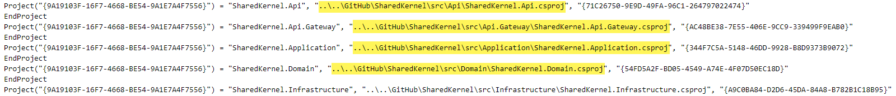

<!-- PROJECT LOGO -->
 

    

# ShopDDD
This is a shop writed in C# with .NET Core and use SharedKernel as core.

## ShopDDD need references to SharedKernel.
### 1 - Download the project: 
> [SharedKernel](https://github.com/pipoburgos/SharedKernel)

### 2 - Edit the file **ShopDDD.sln** and change the routes for **yours own routes**

